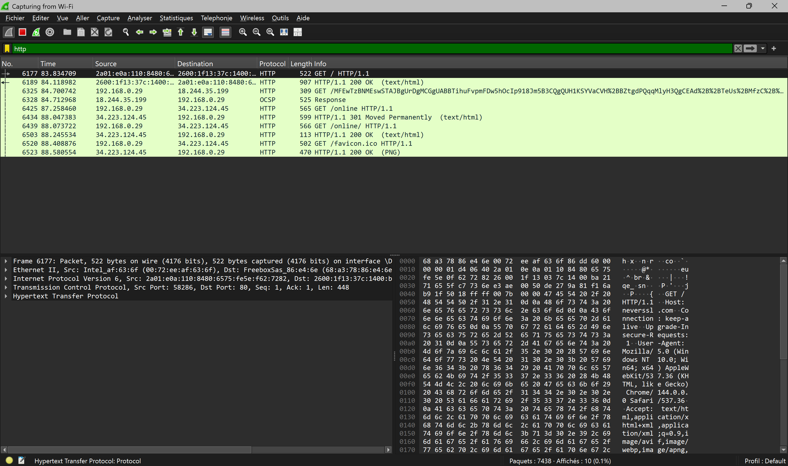
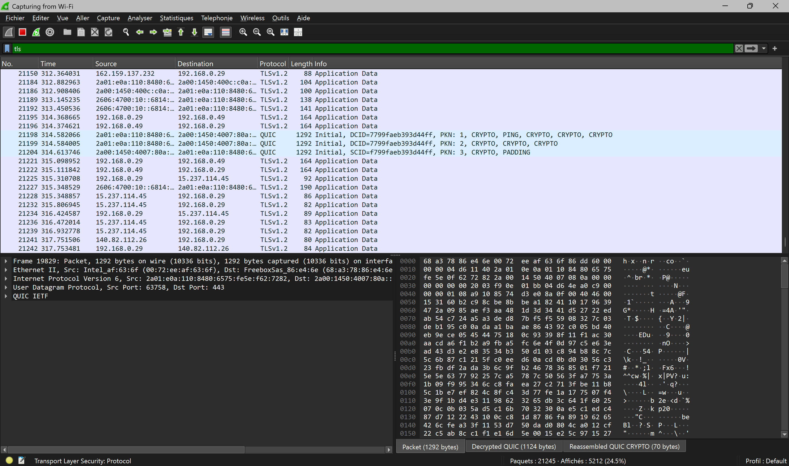

# Basics of HTTP/HTTPS

## 1. Differentiating HTTP and HTTPS

### What's a protocol?

A **protocol** is a set of rules that explain:
- How to formulate a message
- In what order to send it
- How the other party should respond
- And how to interpret the response

Without a protocol, two machines cannot “understand” each other.

---
### HTTP

HTTP is the protocol used to **exchange data on the web**.

**HTTP** stands for **HyperText Transfer Protocol**:
- **HyperText**: originally, the web mainly carried linked text documents (web pages)
- **Transfer**: data is transferred from one point to another
- **Protocol**: communication rules

HTTP is used on the internet to:
- **send a request** from the client to the server (request)
- and **receive an answer** (response)

However, HTTP messages are transmitted in plain text over the network.

Therefore, anyone who intercepts them can read:
- The requested URL
- The data being transmitted (including API calls)...

And sometimes, even sensitive information such as:
- Passwords
- Personal data...

---

### *Capture of an HTTP request with Wireshark*

---
### HTTPS

HTTPS works in the same way as HTTP, but with an additional layer of security via the TLS protocol (formerly SSL).

**HTTPS = HTTP + TLS**

This provides three essential features:
- **Encryption**: content cannot be read if intercepted (cannot be read without the decryption keys)
- **Integrity**: data cannot be modified discreetly in transit (without being detected)
- **Authentication**: the browser verifies that it is communicating with the correct server (this verification is based on a digital certificate)

Adding a security protocol to HTTP ensures that the data transmitted is protected, that it is not directed to a fake site, and that it cannot be modified during transport without being detected.
HTTPS protects transport, not the overall security of the site.

---

### *Capture of an HTTPS request with Wireshark*

